## Goal

Add non-Docker disk quota email notifications that are driven by slave-side background checks, sent by the master with state-based throttling, and surfaced in an admin-only UI page showing historical email attempts.

## High-level architecture

- **Slave responsibilities**: Periodically compute per-user disk quota status (soft/hard, grace remaining/expired) for all non-Docker devices and emit structured events to the master when interesting state transitions occur.
- **Master responsibilities**:
  - Consume these events, resolve host users to OAuth users and email addresses (reusing existing mapping/OAuth code).
  - Apply **state-based throttling** so emails are only sent on meaningful transitions (e.g. first hit soft limit, grace entering final window, grace expired, hard limit reached, back-to-normal), not on every check.
  - Persist an **email notification log** recording the intended recipient, event, email content summary, and send outcome.
- **Frontend (admin only)**: New "notification center" page and nav item listing historical email notification log entries with filters and detail view.

### Data model changes

- **New DB table on master** (SQLAlchemy model in `app/models_db.py`): `NotificationEmailLog` (name can be refined) with columns like:
  - `id` (PK), `created_at` (timestamp), `updated_at` (optional),
  - `oauth_user_id` (nullable), `email` (string),
  - `host_id`, `host_user_name`, `device_name`, `quota_type` (`'block' | 'inode' | 'both' | 'unknown'`),
  - `event_type` (e.g. `soft_enter`, `soft_grace_ending`, `soft_grace_expired`, `hard_reached`, `back_to_ok`),
  - `payload` (JSON/Text for serialized event body from slave),
  - `subject`, `body_preview` (first N chars of body),
  - `send_status` (`success` / `skipped` / `failed`), `error_message` (nullable),
  - `dedupe_key` (string hash of user+device+event state, to help throttling),
  - `last_state` (optional textual snapshot like `status=warning,block_over_soft=true,...`).
- **Alembic migration**: add the new table to master DB (similar style to existing versions in `alembic/versions/*.py`).

### Slave-side: background quota check and event emission

- **New Celery task module** (slave side) e.g. `app/tasks/quota_enforcement_tasks.py` or extend `quota_default_tasks.py` if appropriate, but better to keep separate for clarity.
- **Config loading**:
  - Reuse `_load_quota_config()` pattern from `quota_default_tasks.py` to read `MOCK_QUOTA`, `USE_PYQUOTA`, `USE_ZFS`, etc. from `CONFIG_PATH` or env.
  - Reuse `_load_slave_config()`-like logic from `docker_quota_tasks._load_slave_config` for `SLAVE_HOST_ID`, `MASTER_EVENT_CALLBACK_URL`, `MASTER_EVENT_CALLBACK_SECRET` to POST to master.
- **Quota state computation** (per user per device, non-Docker):
  - Reuse `app.quota.get_devices()` or `collect_remote_quotas()` logic to get devices and user quotas for **block devices/ZFS**, but **exclude Docker virtual device**.
  - For each device with user quotas and for each eligible user (`should_include_uid`): compute a derived **logical state**:
    - Use existing types from `app/models.py` (`UserQuota`, `QuotaInfo`) and the same semantics from `frontend/src/utils/quotaStatus.ts` and `quota_mock.py`:
      - `over_soft_block`: `block_soft_limit > 0` and `block_current >= block_soft_limit * 1024`.
      - `over_soft_inode`: analogous for inode.
      - `over_hard_block`, `over_hard_inode` similarly vs hard limits.
      - For grace, interpret `block_time_limit` / `inode_time_limit` as grace end timestamps (as in `quota_mock` comments), and compare with `now` and `block_grace` / `inode_grace` from device-level `user_quota_info`.
    - Aggregate to a concise `status` for that user+device:
      - `ok`, `soft_over_in_grace`, `soft_over_grace_expired`, `hard_over` (can include flags for block vs inode).
- **State diffing and event generation**:
  - Persist a small **local cache file** on the slave (e.g. JSON in `/var/lib/qman/slave_quota_state.json` or similar path from config) with last known `status` per `(uid, device_name)` or `(host_user_name, device_name)` and last relevant timestamps.
  - On each task run, compare current state to cached state and emit events only when significant transitions occur for non-Docker quotas, for example:
    - `ok → soft_over_in_grace`: `event_type = "disk_soft_limit_exceeded"`.
    - `soft_over_in_grace` with grace end entering a short window (e.g. <= 24h) but previously > 24h: `event_type = "disk_soft_grace_ending"`.
    - `soft_over_in_grace → soft_over_grace_expired`: `event_type = "disk_soft_grace_expired"`.
    - Any state → `hard_over`: `event_type = "disk_hard_limit_reached"`.
    - `over* → ok` (significant drop below soft and hard limits): `event_type = "disk_back_to_ok"`.
  - For each transition, build a slave event object compatible with master endpoint:
    - `{"host_user_name": <linux username>, "event_type": <one of the above>, "detail": {"uid", "device_name", "block_current", "block_soft_limit", "block_hard_limit", "inode_current", "inode_soft_limit", "inode_hard_limit", "block_time_limit", "inode_time_limit", "user_quota_info": {...}}}`.
  - Post a batch of events per host using the existing `_post_events_to_master` pattern from `docker_quota_tasks`, but to the same master `/api/internal/slave-events` endpoint (reusing `SLAVE_HOST_ID`, `MASTER_EVENT_CALLBACK_URL`, `MASTER_EVENT_CALLBACK_SECRET`).
- **Scheduling / frequency**:
  - Register the new task in `app/celery_app.py` beat schedule, using a configurable interval from `AppConfig` (e.g. `QUOTA_NOTIFICATION_SCAN_INTERVAL_SECONDS` with a default like 3600s/1h). This ensures regular scans while avoiding excessive load.

### Master-side: event handling and email behavior

- **Extend `process_slave_events` in `app/notifications.py`**:
  - Recognize the new `event_type` values for non-Docker disk quota: `disk_soft_limit_exceeded`, `disk_soft_grace_ending`, `disk_soft_grace_expired`, `disk_hard_limit_reached`, `disk_back_to_ok`.
  - For each such event:
    - Resolve `(host_id, host_user_name)` → `oauth_user_id` via `OAuthHostUserMapping` (already implemented) and then to `email` via `get_email_for_oauth_user`.
    - Derive a **state key** / `dedupe_key`, e.g. `f"{oauth_user_id}:{host_id}:{device_name}:{event_type}"`.
    - Before sending, consult `NotificationEmailLog`:
      - If there is already a `success` or `skipped` entry for the **same `dedupe_key` and same high-level state** within the past N hours/days, skip sending a new email but still record a log row with `send_status='skipped'` and reason (this supports later tuning but keeps state-based semantics).
      - State-based semantics are primary: because the slave already emits events only on transitions, we mostly just need to guard against repeated identical transitions (e.g. clock skew, multiple slaves, or manual replays).
- **Email content design**:
  - Implement helper functions in `notifications.py` to generate `subject` and `body` for non-Docker disk quota events, e.g.:
    - `disk_soft_limit_exceeded`: subject `[Qman] Disk quota soft limit exceeded`, explaining:
      - Which host and device (`/dev/sdx` or ZFS dataset), which quota type(s) are over, current usage vs soft limit, and that writes may continue during grace.
      - Explain grace end time (absolute and relative, using `block_time_limit` vs `block_grace`) and what actions to take (delete files, move data elsewhere, contact admin).
    - `disk_soft_grace_ending`: subject `[Qman] Disk quota grace period ending soon`, emphasizing remaining time before potential write blocks.
    - `disk_soft_grace_expired`: subject `[Qman] Disk quota grace period expired`, describing that grace is over and writes may already be blocked.
    - `disk_hard_limit_reached`: subject `[Qman] Disk quota hard limit reached`, clarifying that writes are likely blocked until usage is reduced.
    - `disk_back_to_ok`: subject `[Qman] Disk quota back within limits`, confirming that usage is now under soft limits again and the service is back to normal.
  - Use clear, structured plain text with:
    - Host id and device name.
    - User Linux username and (optionally) uid.
    - Quota values and current usage (blocks and human-readable sizes), for both block and inode when relevant.
    - Short guidance; reuse some phrasing from frontend tooltips (`graceTooltipActive`, etc.) for consistency.
- **Logging and throttling implementation**:
  - In `process_slave_events`, after resolving email and building subject/body but before calling `send_email`:
    - Build a `NotificationEmailLog` instance with `send_status` initially `'pending'` (or only set after attempting send), `payload` storing the raw event JSON and derived status, `dedupe_key`, etc.
  - Attempt `send_email` only if SMTP configured and throttling allows; set `send_status` to `'success'` or `'failed'` with `error_message` accordingly.
  - If throttling says "skip", create a row with `send_status='skipped'` and `error_message='throttled (duplicate state)'`.
  - Commit these rows via `SessionLocal` like other DB interactions, ensuring failures do not crash the API; log warning on DB failures but keep service running.

### API surface for notification log (master)

- **New admin-only endpoints in `app/routes/api.py`**, protected by `@oauth.requires_admin`:
  - `GET /api/admin/notifications` with query parameters:
    - Pagination: `page`, `page_size` (or simple `offset`, `limit`).
    - Optional filters: `host_id`, `device_name`, `oauth_user_id`, `email`, `event_type`, `send_status`, time range `from`, `to`.
  - Response shape: e.g. `{ items: [...], total: number }` where each item includes the main fields of `NotificationEmailLog` but limits `body_preview` length and optionally includes derived user name via `OAuthUserCache` or OAuth call.
  - `GET /api/admin/notifications/<id>` to fetch full detail for a single log entry, including the full email body and raw payload (for debugging and audit).

### Frontend: Admin notification center page

- **API client updates** in `frontend/src/api.ts` and `frontend/src/api/schemas.ts`:
  - Add Zod schemas and TS types for `NotificationLogEntry` and paginated list response.
  - Add functions `fetchAdminNotifications(params)` and `fetchAdminNotificationDetail(id)` using Axios and TanStack Query style used elsewhere.
- **New page component** `frontend/src/pages/AdminNotificationsPage.tsx`:
  - Admin-only: mount it under `/manage/notifications`.
  - Use `useQuery` to fetch `GET /api/admin/notifications` with queryKey including current filters and pagination.
  - Layout:
    - Page heading (e.g. `t('notificationCenter')`) with an icon (e.g. `IconBell` or similar from Tabler).
    - Filter controls: host selector (using `fetchHosts`), status multi-select (success/failed/skipped), event type filter, date range picker, free-text search on email/subject.
    - Data table inside `ScrollArea` (similar to `AdminMappingsPage`), columns like:
      - Time (localized), Host, Device, User name / email, Event type (with badge), Send status (colored badge), Subject, and a "View" action.
    - Clicking a row or a "View" button opens a `Modal` showing full email details: subject, to/from, body (plain text in `<pre>`), and raw `payload` (optionally toggleable for advanced debugging).
- **Navigation & routing**:
  - Import the new page into `App.tsx` and add a route:
    - `<Route path="manage/notifications" element={<AdminNotificationsPage />} />`.
  - In `AppShellWithNav`, under the `me.is_admin` block, add a new `NavLink` (e.g. label `t('notificationCenter')`, icon `IconBell`) that is active when path starts with `/manage/notifications` and navigates there.
- **i18n strings**:
  - Extend `translations` in `frontend/src/i18n/index.tsx` with keys like:
    - `notificationCenter`, `notificationCenterDescription`, `notifications`, `eventType`, `sendStatus`, `email`, `subject`, `details`, `backToOk`, `softLimitExceeded`, `softGraceEnding`, `softGraceExpired`, `hardLimitReached`, `sendStatusSuccess`, `sendStatusFailed`, `sendStatusSkipped`, `payloadJson`, `noNotifications`, `failedToLoadNotifications` (and Chinese equivalents).

### Grace handling and timing details

- **Interpretation of grace fields** (pyquota):
  - `QuotaInfo.block_grace` / `inode_grace` are durations (seconds) used by the kernel; `UserQuota.block_time_limit` / `inode_time_limit` are absolute timestamps for grace end.
  - On the slave worker, compute:
    - `seconds_until_block_grace_end = block_time_limit - now` (if `block_time_limit > now`).
    - `seconds_since_block_grace_end = now - block_time_limit` (if already expired).
  - Use these to determine transitions:
    - `soft_grace_ending`: when `over_soft` and `0 < seconds_until_block_grace_end <= min(block_grace, GRACE_ALERT_WINDOW)` where `GRACE_ALERT_WINDOW` is a configuration (default 24 hours).
    - `soft_grace_expired`: when `over_soft` and `seconds_since_block_grace_end >= 0` and state was previously not expired.
- **Config knobs** (optional but helpful):
  - Add fields to `AppConfig` (`models.py`) or to worker config JSON:
    - `QUOTA_NOTIFICATION_GRACE_ALERT_WINDOW_SECONDS` (default 86400),
    - `QUOTA_NOTIFICATION_DEDUPE_WINDOW_SECONDS` (how long master considers an identical state "already notified"; e.g. 86400).

### Security and performance considerations

- **Security**:
  - Reuse existing secret-based auth between slave and master; no new open endpoints.
  - Ensure admin-only endpoints require `@oauth.requires_admin` and return only operational information (no raw passwords/tokens).
- **Performance**:
  - Slave quota scan is similar to `remote-api/quotas` but can be optimized:
    - Reuse code paths that already scan per-device quotas (`collect_remote_quotas_for_uid` is per-user, but here we can either scan per-device once or reuse `remote-api/quotas` logic).
    - Limit scan frequency (e.g. hourly) and rely on state-based deduping.
  - Master-side processing is lightweight and piggybacks on existing `process_slave_events`.

### Implementation order

1. **Backend data model & migration (master)**: add `NotificationEmailLog` to `models_db.py` and create an Alembic migration.
2. **Slave worker**: implement new Celery task for non-Docker quota scanning, state derivation, transition detection, and event emission; wire into Celery beat schedule.
3. **Master notification handling**: extend `process_slave_events` to handle new disk quota event types, implement throttling + logging + email body generators, and integrate with `NotificationEmailLog`.
4. **Admin API**: add `GET /api/admin/notifications` and `GET /api/admin/notifications/<id>` with appropriate filters and pagination.
5. **Frontend admin page**: add API client functions, `AdminNotificationsPage` component, i18n strings, route, and nav link.
6. **Testing and tuning**:
  - Use `MOCK_QUOTA` data (`quota_mock.py`) on a dev slave to simulate over-soft/hard and grace scenarios; confirm expected events and email subjects.
  - Manually trigger the Celery task and inspect `NotificationEmailLog` rows and admin UI.
  - Adjust default intervals and dedupe windows as needed.

### Mermaid diagram: event flow

```mermaid
flowchart LR
  subgraph slaveNode [Slave]
    quotaTask["quotaScanTask (Celery)"] --> quotaState["Compute user+device quota state"]
    quotaState --> quotaDiff["Detect transitions (soft/hard, grace)"]
    quotaDiff --> slaveEvents["Build disk quota events"]
    slaveEvents --> postToMaster["POST /api/internal/slave-events"]
  end

  subgraph masterNode [Master]
    postToMaster --> processEvents["process_slave_events"]
    processEvents --> resolveUser["Resolve OAuth user + email"]
    resolveUser --> throttling["Check NotificationEmailLog (dedupe)"]
    throttling -->|allowed| sendEmailStep["send_email"]
    throttling -->|skipped| logOnly["Log skipped"]
    sendEmailStep --> logResult["Insert NotificationEmailLog row"]
    logOnly --> logResult
    logResult --> adminApi["GET /api/admin/notifications"]
  end

  adminApi --> adminUi["AdminNotificationsPage (frontend)"]
```

