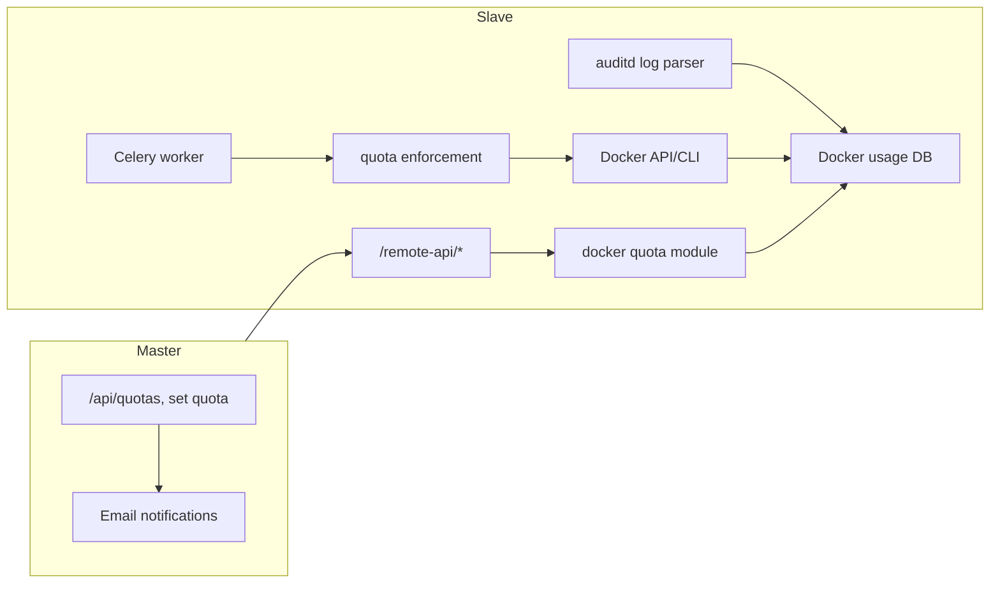

# Docker filesystem quota control – full pipeline

## Current architecture (reference)

- **Master**: Flask app with `/api/*`; aggregates quotas from slaves via `SLAVES` config; OAuth + `OAuthHostUserMapping` (oauth_user_id ↔ host_id, host_user_name); no Celery.
- **Slave**: Flask app with `/remote-api/*`; merges [quota.py](app/quota.py) (usrquota/pyquota) and [quota_zfs.py](app/quota_zfs.py) when `USE_ZFS`; returns list of devices with `user_quotas`.
- **Data shape**: Each device has `name`, `mount_points`, `fstype`, `usage`, `user_quotas` (uid, name, block_ */ inode_*). Frontend and dashboard consume this shape.

## Target architecture

- **Master**: Keeps a high-level abstract interface only. No auditd, no Docker, no Celery. Adds email sending for key events (quota exceeded, container killed); resolves email via `oauth.get_user_by_id()` (User has `email` in [auth_connect/oauth.py](auth_connect/oauth.py)).
- **Slave**: All low-level work: auditd collection, Docker attribution, per-user usage aggregation, quota enforcement (Celery), and reporting a virtual “Docker” device in the same device list so existing master/frontend logic stays unchanged.

## 1. Conceptual model and data flow

- **Virtual device**: Per host, one logical “Docker” device (e.g. `name`: `"docker"`, `fstype`: `"docker"`, `mount_points`: `[/var/lib/docker]` or the actual data root). Physical device that stores Docker data can be discovered by matching actual data root against known mount points; Docker quota is a separate logical device so it can coexist with usrquota/ZFS on that same disk.
- **Reservation**: Slave “reserve” part of the physical device for Docker based on sum of user quotas, or `DOCKER_QUOTA_RESERVED_BYTES` (optional) ; total disk usage = non-Docker usage (usrquota/ZFS) + Docker usage (capped by sum of user quotas).
- **Attribution**: Containers → creator (uid/host_user_name); images → puller. Use auditd (docker socket + `docker` binary) plus Docker API/CLI (inspect, events, labels) to build and maintain a mapping: container_id/image_id → user. Persist on slave DB so usage is stable across restarts.
- **Enforcement**: Periodic task on slave: for each user with Docker quota, if usage > quota, stop and then remove containers (policy: e.g. freshest first) until under quota; emit event for master to notify user by email.

## 2. Slave: auditd and Docker attribution

- **auditd rules** (deploy via config/file, not in Python):
  - Watch access to Docker socket: e.g. `-w /var/run/docker.sock -p rwxa -k docker`.
  - Watch execution of Docker client: e.g. `-w /usr/bin/docker -p x -k docker`.
- **Log consumer** (slave):
  - Parse audit logs (e.g. `ausearch`) for `key=docker`; extract uid, pid, timestamp, and (where possible) operation (e.g. `container create`, `image pull`).
  - Map pid → uid from audit; associate `container create` → creator uid; `image pull` → puller uid.
- **Docker API/CLI usage** (slave):
  - Use `docker` Python SDK or subprocess to: list containers (including stopped), list images, inspect container/image (labels, creation time), `docker system df -v` for per-container/image disk usage.
  - Prefer labeling containers at create time (e.g. `qman.user=username`) if possible; otherwise rely on audit log correlation (container id ↔ uid at create time).
- **Persistence**: Store on slave (SQLite): `(host_user_name or uid, container_id, image_id, size_bytes, created_at)` and optionally `(image_id, puller_uid, size_bytes)`. Reconcile with current `docker ps -a` and `docker images` so removed resources are dropped from usage.

Deliverables:

- New module e.g. `app/docker_quota/` on slave: `audit_parser.py`, `docker_client.py`, `attribution_store.py`, and a small DB schema/migrations for attribution and optionally per-user usage cache.

## 3. Slave: Docker quota reporting (virtual device)

- **Usage aggregation**: For each host user (from attribution store + current containers/images), compute total Docker disk usage (container writable layers + image layers attributed to that user). Use `docker system df -v` and container/image IDs to size; attribute layers by container ownership and image puller.
- **Quota limits**: Store per-user Docker quota on slave (in same store or config). Limit is in bytes (or 1K blocks to match existing `UserQuota`); expose in same shape as [quota_zfs.py](app/quota_zfs.py) / [quota.py](app/quota.py): `block_hard_limit`, `block_current`, etc. (inode can be 0 or placeholder).
- **Virtual device**: Implement `get_devices()` and `collect_remote_quotas()` / `collect_remote_quotas_for_uid()` for Docker: return one device per host with `fstype="docker"`, `name="docker"`, `mount_points=[docker_data_root]`, `usage` (total=sum of user quota or `DOCKER_QUOTA_RESERVED_BYTES` (optional), free=total - used ), `user_quotas` list. Merge this into existing remote API response in [remote_api.py](app/routes/remote_api.py) when `USE_DOCKER_QUOTA` is true (same way ZFS is merged).
- **Set quota**: New remote endpoint or extend existing: set Docker quota for a (uid or host_user_name). Slave stores limit in attribution store and returns updated `UserQuota`-shaped dict.

Config (slave): e.g. `USE_DOCKER_QUOTA`, `DOCKER_DATA_ROOT`, `DOCKER_QUOTA_RESERVED_BYTES` (optional), `AUDIT_LOG_PATH` or use `ausearch`.

## 4. Slave: quota enforcement with Celery

- **Celery**: Add Celery to slave (broker: Redis or RabbitMQ; config on slave). Worker runs on the same host as Docker and auditd.
- **Periodic task**: e.g. `enforce_docker_quota` every N minutes. For each user with a Docker quota, if `block_current > block_hard_limit`, select containers to stop/remove (e.g. oldest first, or by label), then call Docker API to stop and remove; update attribution store; log clearly (see below). Optionally emit an “event” (HTTP callback to master or store in a table for master to poll).
- **Event payload**: At least `host_id`, `host_user_name`, `oauth_user_id` (if known on slave we don’t have it; master can resolve host_user_name → oauth_user_id via mappings), `event_type` (e.g. `quota_exceeded`, `container_removed`), `detail` (container id, new usage).

Master can poll slave for “recent events” or slave can POST to master (authenticated) to report events; master then resolves oauth_user_id → email and sends notification.

## 5. Master: high-level interface and notifications

- **No new low-level logic**: Master already fetches `/remote-api/quotas` and `/remote-api/quotas/users/<uid>` and merges by host. Once slave returns the Docker device in that list, master and frontend automatically show it (same device list and set-quota flow). Optionally: master `PUT` for “docker” device goes to slave with a device param like `device=docker`; slave already has `USE_DOCKER_QUOTA` and handles it.
- **Set quota on master**: Reuse existing `PUT /api/quotas/<slave_id>/users/<uid>?device=docker`; slave distinguishes `device=docker` from block device or ZFS dataset and calls Docker quota setter.
- **Email notifications**: New module on master (e.g. `app/notifications.py`): SMTP config (from app config or env), `send_email(to_email, subject, body)`. Key events to notify (to the affected user’s email from OAuth profile):
  - Quota exceeded (user over Docker quota).
  - Container(s) removed due to quota enforcement.
  - Optionally: warning at e.g. 80% usage.

Resolve email: use `oauth.get_user_by_id(oauth_user_id)` to get `User.email`; if unavailable, log and skip. Events can be received by master via slave callback or by master polling slave “events” endpoint; master maps host_user_name → oauth_user_id via [OAuthHostUserMapping](app/models_db.py).

- **Event ingestion on master**: Add an authenticated endpoint e.g. `POST /api/internal/slave-events` (or poll `GET /remote-api/docker-events` from master) with payload `[{ "host_id", "host_user_name", "event_type", "detail" }]`. Master resolves to oauth_user_id, then to email, then sends mail and logs.

## 6. Coexistence with usrquota and ZFS

- **Physical device**: The disk that holds `/var/lib/docker` may already be under usrquota or ZFS. Do not double-count: treat Docker as a separate *logical* device. Report Docker usage as a virtual device and let admin set Docker user quotas independently; physical device quotas still apply to non-Docker usage.
- **Merge order**: In [remote_api.py](app/routes/remote_api.py), merge order remains: pyquota devices, then ZFS, then Docker. Same for per-uid. No change to physical device quota logic in [quota.py](app/quota.py) or [quota_zfs.py](app/quota_zfs.py).

## 7. Logging and operations

- **Structured logging**: Use existing [app/utils.py](app/utils.py) `get_logger(__name__)` in all new code. Log at INFO: quota checks, enforcement runs, containers removed (with container id, user, before/after usage). Log at WARNING/ERROR: audit parse failures, Docker API errors, enforcement failures. Include host_id (or “slave”) and host_user_name/uid in log messages for admin filtering.
- **Admin visibility**: Existing dashboard and host/device pages will show the Docker device and over-quota users; no separate “Docker only” dashboard required unless you add a dedicated view later. Optional: add a “Docker events” or “Enforcement log” panel that reads from slave (or master-stored events).

## 8. Configuration and dependencies

- **Backend (slave)**: Add to [requirements.txt](requirements.txt): `celery`, `redis` (or `amqp` for RabbitMQ), `docker` (Docker SDK for Python). auditd is system-level (no Python package).
- **Backend (master)**: Add optional `app/notifications.py` with SMTP (e.g. `smtplib` or `flask-mail`). Config: `SMTP_HOST`, `SMTP_PORT`, `SMTP_USER`, `SMTP_PASSWORD`, `NOTIFICATION_FROM`.
- **Config model**: Extend [AppConfig](app/models.py) (and example configs) with: slave: `USE_DOCKER_QUOTA`, `DOCKER_DATA_ROOT`, `DOCKER_QUOTA_RESERVED_BYTES`, `CELERY_BROKER_URL`, `AUDIT_*`; master: `SMTP_*`, `NOTIFICATION_*`. Validation: if `USE_DOCKER_QUOTA` then Docker and Celery config required on slave.

## 9. Frontend

- **Minimal change**: Existing [DeviceQuota](frontend/src/api/schemas.ts) and device list/detail pages work if the Docker device has the same shape (`name`, `mount_points`, `fstype`, `usage`, `user_quotas`). Optionally add `fstype === 'docker'` to show an icon or label “Docker” in [HostDetailPage](frontend/src/pages/HostDetailPage.tsx) and [MyUsagePage](frontend/src/pages/MyUsagePage.tsx). No new API contract; optional i18n for “Docker” and “Container removed due to quota”.

## 10. Implementation order (suggested)

1. **Slave: Docker attribution and store** – audit log parser (or stub), Docker client (list/inspect/df), persistence (DB or file) for user → container/image usage.
2. **Slave: Virtual device and merge** – `docker_quota.collect_remote_quotas()` and `collect_remote_quotas_for_uid()`, merge in remote_api when `USE_DOCKER_QUOTA`; implement set quota for `device=docker`.
3. **Slave: Celery and enforcement** – Celery app, `enforce_docker_quota` task, schedule (e.g. celery beat or cron); on over-quota, stop/remove containers and log; optionally POST events to master.
4. **Master: Events and email** – endpoint for slave events (or poll), resolve host_user_name → oauth_user_id → email, `send_email()` and logging.
5. **Config, docs, and deploy** – auditd rule files, config examples, README section on Docker quota and notifications.
6. **Frontend** – optional UI tweaks and i18n for Docker.

## Files to add or touch (summary)

| Area                 | Files                                                                                                                                                    |

| -------------------- | -------------------------------------------------------------------------------------------------------------------------------------------------------- |

| Slave Docker quota   | New `app/docker_quota/` (e.g. `attribution.py`, `docker_client.py`, `quota.py`, `models.py` for store); alembic migration for docker_* tables if DB used |

| Slave remote API     | [app/routes/remote_api.py](app/routes/remote_api.py) – merge Docker device; handle `device=docker` in set-quota                                          |

| Slave Celery         | New `app/celery_app.py`, `app/tasks/docker_quota_tasks.py`; entrypoint for worker                                                                        |

| Master notifications | New `app/notifications.py`; [app/routes/api.py](app/routes/api.py) – event endpoint and call to notifications                                            |

| Config               | [app/models.py](app/models.py) – AppConfig; [app/**init**.py](app/__init__.py) – load new keys; config.*.json examples                                   |

| OAuth user email     | Use existing `oauth.get_user_by_id()`; optionally extend [OAuthUserCache](app/models_db.py) with `email` and refresh on demand for notifications         |

| Logging              | Use `get_logger(__name__)` in all new modules                                                                                                            |

| Frontend             | Optional: [HostDetailPage](frontend/src/pages/HostDetailPage.tsx), [MyUsagePage](frontend/src/pages/MyUsagePage.tsx), i18n                               |

No change to existing usrquota or ZFS logic; Docker is an additional backend merged at the same abstraction level as ZFS