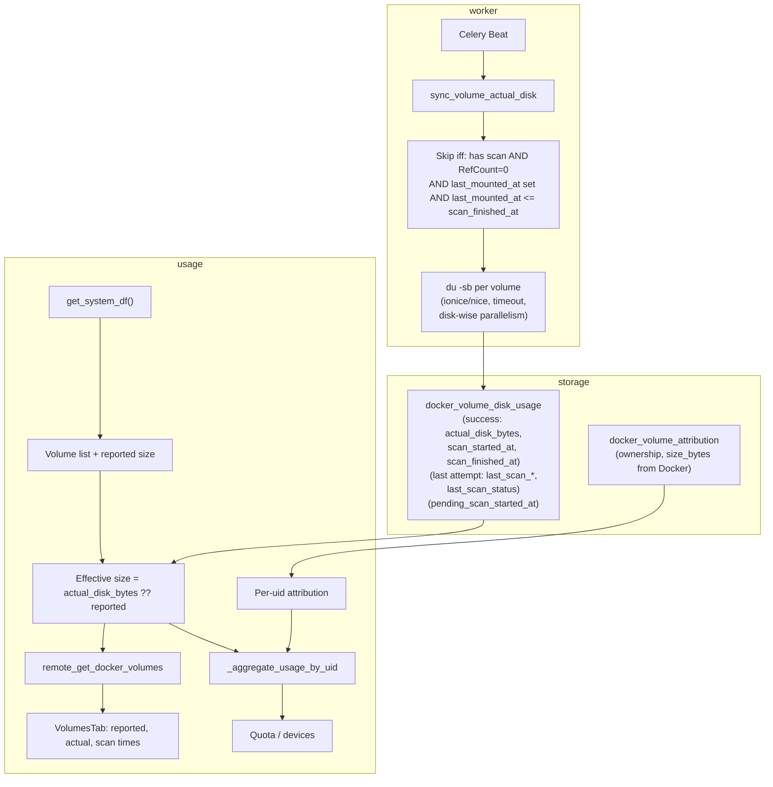

# Volume actual disk cost worker and calibration (revised)

## Overview

Add a background worker that periodically measures **actual disk usage** of **all** Docker volumes (attributed and unattributed) via `du -sb` on each volume mountpoint (with low I/O priority and disk-wise parallelism). Store results, **pending** and **completed** scan timestamps, and **last scan status** (success/timeout/permission/parse failure) in a dedicated table; use actual size to calibrate quota and display. Show reported vs actual and scan timestamps (including "scan in progress") in the UI. Skip re-scanning only when **all** of: has scan, RefCount == 0, last_mounted_at set, last_mounted_at <= scan_finished_at (both RefCount and Docker events required for robustness).

---

## 1. Scan all volumes (attributed and unattributed)

- **Dedicated table for scan results:** Store disk scan data for every volume we scan, regardless of attribution. Attribution (who owns the volume) stays in `docker_volume_attribution`; **actual disk size and timestamps** live in a new table so unattributed volumes can also have calibrated sizes.
- **New table `docker_volume_disk_usage`** (or similar name):
  - `volume_name` (PK)
  - **Success tuple (always consistent):** `actual_disk_bytes`, `scan_started_at`, `scan_finished_at` – updated **only when a scan succeeds**. If a later run fails (timeout, permission, parse), we **do not** overwrite these three; they always refer to the last successful scan. So the tuple (actual_disk_bytes, scan_started_at, scan_finished_at) is preserved across later errors.
  - **Last attempt (any outcome):** `last_scan_started_at`, `last_scan_finished_at`, `last_scan_status` – updated on **every** completed run (success or failure). `last_scan_status` = `'success'` | `'timeout'` | `'permission_denied'` | `'parse_failure'`. Enables UI to show "Last attempt: failed (timeout) at …" without touching the success tuple.
  - **Pending scan:** `pending_scan_started_at` (nullable) – set when we start `du`; cleared when the run finishes. Non-null = "scan in progress since …".
  - **Worker logic:** On success: set actual_disk_bytes, scan_started_at, scan_finished_at **and** last_scan_* / last_scan_status. On failure: set **only** last_scan_started_at, last_scan_finished_at, last_scan_status; leave actual_disk_bytes, scan_started_at, scan_finished_at unchanged.
- **Aggregation and API:** For each volume we have (from `get_system_df()`): Docker-reported size and optional row in `docker_volume_disk_usage`. **Effective size** = `actual_disk_bytes` if present, else Docker-reported size. Use effective size for `total_volume_used`, per-uid usage, and API totals. No change to attribution logic (ownership still from `docker_volume_attribution`).

---

## 2. Robust scanning of huge mountpoints

- **Per-volume timeout:** Run `du -sb <path>` in a subprocess with a **configurable timeout per volume** (e.g. 30–60 minutes default) so one huge directory does not block the worker indefinitely. On timeout: log, update only last_scan_* and last_scan_status; leave the success tuple (actual_disk_bytes, scan_started_at, scan_finished_at) unchanged.
- **Record timestamps:** Set `pending_scan_started_at` when starting. On **success**: set actual_disk_bytes, scan_started_at, scan_finished_at (success tuple) and last_scan_*; clear pending. On **failure**: set only last_scan_started_at, last_scan_finished_at, last_scan_status; clear pending; do not touch the success tuple.
- **I/O and concurrency:**
  - **Run `du` with low I/O priority** when applicable (e.g. on Linux use `ionice -c3` and/or `nice` when spawning the subprocess) so the background scan does not starve other workloads. Use this by default where available; document if not (e.g. non-Linux).
  - **Disk-wise parallelism:** We manage multiple disks (e.g. multiple volume roots or hosts). To speed up the overall scan without overloading a single disk: **group volumes by disk** (e.g. resolve each volume path to its block device or mount point via `os.stat(path).st_dev` or `df`), then allow **parallelism across disks** while **capping concurrency per disk** (e.g. at most 1 scan per disk at a time). So volumes on disk A and disk B are scanned concurrently, but two volumes on the same disk are scanned one after the other. Config: e.g. max concurrent scans per disk = 1, or a small number.
- **Subprocess and errors:** Use `subprocess.run(..., timeout=per_volume_timeout, capture_output=True)`. Parse `du -sb` stdout (first token = bytes). **On success:** set `actual_disk_bytes`, `scan_started_at`, `scan_finished_at` (success tuple) and `last_scan_started_at`, `last_scan_finished_at`, `last_scan_status='success'`; clear `pending_scan_started_at`. **On failure (timeout / permission / parse):** set only `last_scan_started_at`, `last_scan_finished_at`, `last_scan_status` to the appropriate value; clear `pending_scan_started_at`; **do not** modify `actual_disk_bytes`, `scan_started_at`, or `scan_finished_at` (success tuple stays as-is).
- **Task-level timeout:** Celery task should have a generous `time_limit` (e.g. several hours) so that many volumes can be processed in one run; each volume still has its own timeout so a single stuck `du` does not hang the worker forever.

---

## 3. Timestamps and frontend

- **Backend:** Store success tuple (only on success) and last-attempt fields (on every completion). API returns for each volume:
  - `reported_size_bytes` – Docker API size.
  - `actual_disk_bytes`, `scan_started_at`, `scan_finished_at` – **last successful** scan (consistent tuple); null if never succeeded.
  - `last_scan_started_at`, `last_scan_finished_at`, `last_scan_status` – most recent attempt (success or failure).
  - `pending_scan_started_at` – if non-null, "scan in progress since …".
  - `size_bytes` – effective size for totals (actual_disk_bytes if present, else reported).
- **Frontend (VolumesTab):** Show **reported size** and **actual disk** (with "Last successful scan: started … finished …" from scan_started_at / scan_finished_at). Separately show **last attempt** (last_scan_* and last_scan_status, e.g. "Last attempt: failed (timeout) at …"). If pending_scan_started_at set, show "Scan in progress since …".
- **Zod schema:** Add optional `actual_disk_bytes`, `reported_size_bytes`, `scan_started_at`, `scan_finished_at`, `last_scan_started_at`, `last_scan_finished_at`, `last_scan_status`, `pending_scan_started_at`.

---

## 4. Smart skip: avoid repeated scanning of inactive volumes

**Goal:** Do not re-scan a volume that already has an actual disk size and has not been "used" since the last scan, to save I/O.

**Option A – RefCount-based (no events):**

- When the worker runs, for each volume from Docker:
  - If we **do not** have a row in `docker_volume_disk_usage` (or `actual_disk_bytes` is null): **always scan** (first time or previous scan failed).
  - If we **do** have a successful scan (`actual_disk_bytes` and `scan_finished_at` set): **skip** if `RefCount == 0` (no container currently using the volume); **scan** if `RefCount > 0`.
- Rationale: Inactive volumes (RefCount 0) are unlikely to change; active ones might have new data. No Docker events or audit logs required. Downside: a volume that was used and then unmounted will be skipped until something mounts it again (RefCount > 0), so actual size might be slightly stale for recently unmounted volumes.

**Option B – Docker events (optional enhancement):**

- Track **last time a volume was mounted** (any container started with that volume mounted). When we know "no container has mounted this volume since last scan", we can skip even if we later add more event types.
- **Implementation:**
  - **Persist** `volume_last_mounted_at` (or `last_used_at`) per volume. Options: new table `docker_volume_last_used(volume_name, last_mounted_at)` or a column on `docker_volume_disk_usage`. Prefer a separate small table or column so it’s clear and can be updated from events.
  - **Update on Docker events:** In the existing event-processing path (e.g. `sync_from_docker_events()` in [app/docker_quota/attribution_sync.py](app/docker_quota/attribution_sync.py)), when we see a **container** event with **action "start"**, resolve that container’s volume mounts (e.g. one `inspect` per container start, or use event payload if Docker provides mount info). For each volume name in the mounts, set `volume_last_mounted_at[volume_name] = event_timestamp`.
  - **Worker skip logic:** When considering whether to scan volume V: if we have `actual_disk_bytes` and `scan_finished_at`, and we have `last_mounted_at` for V, and `last_mounted_at <= scan_finished_at` (or no write since scan): **skip**. Otherwise (never scanned, or no last_mounted_at, or last_mounted_at > scan_finished_at): **scan**.
- **Audit logs:** Not required for "last mounted." Audit logs are used for attribution (who created the container), not for "when did a volume get mounted." Docker events are the right source for "container start" and thus "volume mounted."

**Recommendation:** Implement **Option A** first (RefCount-based skip). Add **Option B** as an optional enhancement so that we can skip volumes that are inactive in the sense of "not mounted since last scan" even if RefCount is currently 0 and the volume was used after the last scan (e.g. mount then unmount). If Option B is added, the worker uses: skip if (has scan and (RefCount == 0 **or** (last_mounted_at is set and last_mounted_at <= scan_finished_at))).

---

## 5. Data model and data flow

- **Quota and totals:** Use effective size (actual_disk_bytes if present, else Docker reported) for every volume in `_aggregate_usage_by_uid` and in device/usage APIs. Attribution (which UID owns the volume) is unchanged and still comes from `docker_volume_attribution`.
- **Reconciliation:** When a volume is removed from Docker, remove its row from `docker_volume_disk_usage` as well (e.g. in the same reconciliation that removes from `docker_volume_attribution`, or a separate pass that deletes disk_usage rows for volumes not in Docker’s volume list).

---

## 6. Files to create or modify

| Area            | File                                                                                                            | Change                                                                                                                                                                                                                                                                                                                                                    |
| --------------- | --------------------------------------------------------------------------------------------------------------- | --------------------------------------------------------------------------------------------------------------------------------------------------------------------------------------------------------------------------------------------------------------------------------------------------------------------------------------------------------- |
| Schema          | New Alembic migration                                                                                           | Create `docker_volume_disk_usage` (volume_name PK, actual_disk_bytes, scan_started_at, scan_finished_at, pending_scan_started_at, last_scan_status). Create `docker_volume_last_used` (volume_name, last_mounted_at) for event-based skip.                                                                                                                |
| Model           | [app/models_db.py](app/models_db.py)                                                                            | Add `DockerVolumeDiskUsage`: success tuple (actual_disk_bytes, scan_started_at, scan_finished_at), last_scan_started_at, last_scan_finished_at, last_scan_status, pending_scan_started_at; and store for last_mounted_at.                                                                                                                                 |
| Store           | New or existing in [app/docker_quota/attribution_store.py](app/docker_quota/attribution_store.py) or new module | `get_volume_disk_usage()`, upsert: on success update success tuple + last_scan_*; on failure update only last_scan_* and last_scan_status; manage pending_scan_started_at. Get/set `last_mounted_at`. Reconcile: delete disk_usage rows for volumes not in Docker list.                                                                                   |
| Quota           | [app/docker_quota/quota.py](app/docker_quota/quota.py)                                                          | In `_aggregate_usage_by_uid`, for each volume get effective size from `docker_volume_disk_usage` if present else Docker size; use for total_volume_used and per-uid.                                                                                                                                                                                      |
| API             | [app/routes/remote_api.py](app/routes/remote_api.py)                                                            | Return success tuple (actual_disk_bytes, scan_started_at, scan_finished_at), last attempt (last_scan_started_at, last_scan_finished_at, last_scan_status), pending_scan_started_at, reported_size_bytes, effective size_bytes; totals use effective size.                                                                                                 |
| Worker          | New `app/docker_quota/volume_actual_disk.py`                                                                    | Get volumes + mountpoints; resolve path → device for disk-wise grouping; apply skip (all four conditions); set pending_scan_started_at, run `du` with ionice/nice and timeout. On success: update success tuple + last_scan_*; on failure: update only last_scan_* and last_scan_status; clear pending. Parallelism: per-disk cap, parallel across disks. |
| Task            | [app/tasks/docker_quota_tasks.py](app/tasks/docker_quota_tasks.py)                                              | New Celery task calling `collect_volume_actual_disk()`.                                                                                                                                                                                                                                                                                                   |
| Celery          | [app/celery_app.py](app/celery_app.py)                                                                          | Register new task in beat_schedule and task_routes; add config for sync interval, per-volume timeout, disk-wise parallelism.                                                                                                                                                                                                                              |
| Events          | [app/docker_quota/attribution_sync.py](app/docker_quota/attribution_sync.py)                                    | On container "start" event, get container Mounts, update `last_mounted_at` for each volume (required for smart skip).                                                                                                                                                                                                                                     |
| Frontend schema | [frontend/src/api/schemas.ts](frontend/src/api/schemas.ts)                                                      | Extend volume schema with success tuple (actual_disk_bytes, scan_started_at, scan_finished_at), last attempt (last_scan_started_at, last_scan_finished_at, last_scan_status), pending_scan_started_at, reported_size_bytes.                                                                                                                               |
| Frontend UI     | [frontend/src/components/docker/VolumesTab.tsx](frontend/src/components/docker/VolumesTab.tsx)                  | Show reported size; actual disk with "Last successful scan: …" (scan_started_at/scan_finished_at); "Last attempt: …" (last_scan_* + last_scan_status); "Scan in progress since …" when pending_scan_started_at set.                                                                                                                                       |
| Docs            | [docs/DOCKER_VOLUME_QUOTA_DESIGN.md](docs/DOCKER_VOLUME_QUOTA_DESIGN.md)                                        | Short section on actual-disk calibration, timestamps, and skip logic.                                                                                                                                                                                                                                                                                     |

---

## 7. Config summary

- `DOCKER_VOLUME_ACTUAL_DISK_SYNC_INTERVAL_SECONDS` – interval for the Celery beat task (e.g. 21600 = 6 hours).
- `DOCKER_VOLUME_ACTUAL_DISK_TIMEOUT_PER_VOLUME_SECONDS` – timeout for each `du` subprocess (e.g. 3600 = 1 hour).
- Run `du` with low I/O priority by default (ionice/nice on Linux).
- Disk-wise parallelism: e.g. max concurrent scans per disk = 1 (configurable); volumes grouped by device (e.g. `st_dev` or `df`).

---

## 8. Edge cases

- **Volume deleted:** Reconcile removes its row from `docker_volume_disk_usage` when the volume no longer exists in Docker.
- **du timeout or failure:** Log, set only `last_scan_started_at`, `last_scan_finished_at`, `last_scan_status`; clear `pending_scan_started_at`. Do **not** modify the success tuple (actual_disk_bytes, scan_started_at, scan_finished_at); next run can retry.
- **Permission denied on path:** Same as failure; do not crash the worker.
- **First run / never scanned:** `actual_disk_bytes` and timestamps null; UI shows "Not scanned"; effective size = reported size.
- **Worker runs as non-root:** Must have read access to Docker volume paths (e.g. docker group); document in README.

